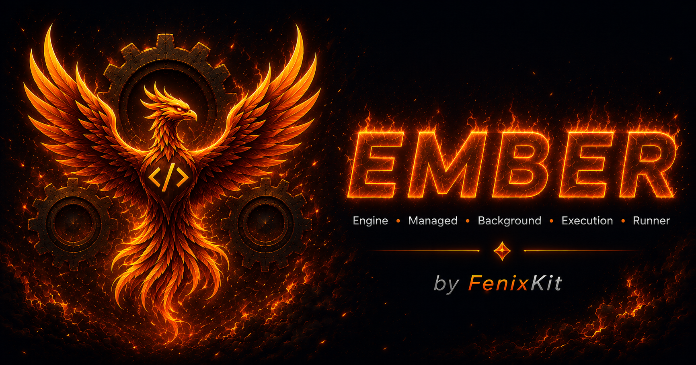
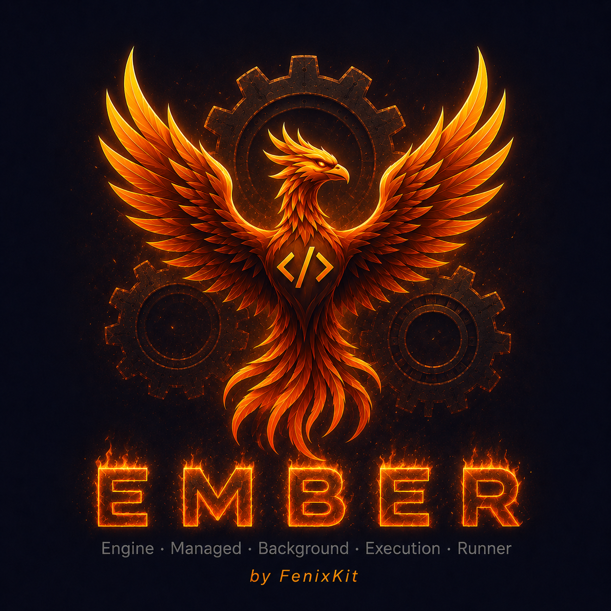

# EMBER by FenixKit — Engine · Managed · Background · Execution · Runner

<p align="center">
  <a href="https://fenixkit.dev/kits/ember/">
    
  </a>
</p>
<p align="center">
  
</p>
<h3 align="center">
  <a href="https://fenixkit.dev/kits/ember/">fenixkit.dev/kits/ember/</a>
</h3>

> **EMBER — Engine · Managed · Background · Execution · Runner**
> The complete .NET Minimal API template — MongoDB, Keycloak JWT, Redis cache-aside, S3 file storage, and Hangfire background jobs all pre-configured in one project.

## What's Inside

| Feature | Details |
|---|---|
| **Keycloak Auth** | JWT Bearer validation |
| **Role-based policies** | `Authenticated` and `AdminOnly` policies wired in from the start |
| **Swagger OAuth2 PKCE** | Authorize button in Swagger UI logs in via Keycloak — tokens injected automatically |
| **Pre-built realm** | `realm-export.json` imported at startup — two test users, one client, two roles |
| **Redis cache-aside** | 3-level tag-based invalidation; FailOpen / FailClosed; optional via `Cache:Enabled` |
| **S3 object storage (Garage)** | Self-hosted S3-compatible storage; three access modes: Public, PresignedUrl, Proxy |
| **File attachment system** | `FileAttachment` entity + `FileRepository`; attach files to any entity by type + role |
| **Product image endpoints** | `POST/DELETE /api/products/{id}/image` — replaces on upload, cleans S3 on delete |
| **Presigned URL caching** | `GetCacheTtl()` hook ties cache TTL to presigned URL expiry — stale URLs never served |
| **Keycloak health check** | `/health/ready` includes Keycloak reachability via OIDC discovery |
| **Redis health check** | `/health/ready` includes Redis ping — omitted automatically when cache is disabled |
| **Garage health check** | `/health/ready` includes Garage S3 API reachability |
| **Auth example endpoints** | `/api/auth-examples/me` and `/api/auth-examples/admin` — working patterns to copy |
| **Minimal API** | Route grouping, no controllers, fast startup |
| **MongoDB** | `MongoRepository` via `IDBRepository`, singleton, health-checked |
| **ErrorOr** | Result pattern throughout — no exceptions for control flow |
| **Offset + Cursor pagination** | Both strategies included, pick the right one per endpoint |
| **BaseRepository** | 13 domain hooks + 1 error hook + 5 cache hooks — extend CRUD without rewriting it |
| **Global error handler** | RFC 7807 `ProblemDetails` on every unhandled exception |
| **Docker + Compose** | API + MongoDB + Keycloak + Redis + Garage, healthcheck-gated startup order |
| **Background jobs (Hangfire)** | Fire-and-forget, delayed, and recurring jobs; MongoDB-backed persistence; priority queues (`high` / `normal`); multi-server config; dashboard at `/jobs` |
| **Job admin endpoints** | `POST /api/jobs/*/trigger` and `GET /api/jobs/stats` — AdminOnly, integrated with ErrorOr |
| **Valkey support** | `docker-compose.valkey.yml` — drop-in Redis replacement, BSD-3-Clause licence |
| **Environment variables** | `.env.example` with placeholder resolution via Steeltoe |

---

## Why Not Wire This Yourself?

| Starting from scratch | Using FenixKit |
|---|---|
| Hours configuring JWT Bearer options | Pre-configured, tested, ready |
| Manual Keycloak realm + client setup | `realm-export.json` imported on first `docker compose up` |
| Swagger Authorize button doesn't work | OAuth2 PKCE flow wired in — click Authorize, log in, done |
| Role checks scattered across handlers | Centralised policies: `RequireAuthorization("AdminOnly")` |
| No health check on the auth server | Keycloak OIDC discovery check in `/health/ready` |
| Token validation breaks on key rotation | Keycloak public keys fetched automatically via metadata URL |
| Reading claims is inconsistent | Typed `UserInfoResponse` with username, email, roles, subject |
| Cache invalidation built from scratch | Tag-based invalidation in `BaseRepository` — automatic on every write |
| Redis outage kills the API | FailOpen mode: Redis errors treated as cache misses, falls through to MongoDB |
| File storage wired manually per entity | `FileRepository` + `IStorageService` handle upload, presigned URLs, proxy streaming |
| Presigned URLs cached beyond expiry | `GetCacheTtl()` hook bounds cache TTL to URL expiry — stale URLs never returned |
| S3 setup + credentials in every handler | `StorageOptions` + per-bucket config — handlers call one method, storage handles the rest |
| Background jobs wired manually | Hangfire + MongoDB persistence pre-configured; fire-and-forget, delayed, and recurring jobs ready to extend |
| Job queue setup from scratch | Two-server priority queue model configured in `appsettings.json`; `IBackgroundJobService` with ErrorOr throughout |

---

## Authentication Architecture

Keycloak issues JWT tokens. The API validates every token against the Keycloak  — fetched automatically from the OIDC discovery document.

```
Client → POST /realms/fenixkit/protocol/openid-connect/token → JWT
Client → GET  /api/products/ + Bearer <JWT> → API validates → 200 OK
                                                             → 401 if missing/invalid
                                                             → 403 if wrong role
```

## Protecting Endpoints

```csharp
// Any authenticated user
group.MapGet("/orders", GetOrders)
    .RequireAuthorization("Authenticated");

// Admin role only
group.MapDelete("/orders/{id}", DeleteOrder)
    .RequireAuthorization("AdminOnly");
```

Both policies are defined in `Auth/Keycloak/Extensions/AuthExtensions.cs`. Adding a new policy is one block:

```csharp
.AddPolicy("PremiumOnly", policy =>
    policy.RequireAuthenticatedUser()
          .RequireRole("premium"))
```

Then assign the `premium` realm role to users in the Keycloak admin console.

---

## Reading the Current User

```csharp
private static IResult Me(HttpContext ctx)
{
    var username = ctx.User.Identity?.Name;           // preferred_username claim
    var email    = ctx.User.FindFirst("email")?.Value;
    var subject  = ctx.User.FindFirst("sub")?.Value;
    var isAdmin  = ctx.User.IsInRole("admin");
    var roles    = ctx.User.FindAll("roles").Select(c => c.Value);

    return Results.Ok(new UserInfoResponse(username, email, subject, roles));
}
```

`/api/auth-examples/me` is a working example of this pattern included in the kit.

---

## Pre-configured Keycloak Realm

`keycloak/realm-export.json` is imported automatically on first startup. No manual steps.

| Item | Value |
|---|---|
| Realm | `fenixkit` |
| Client | `fenixkit-api` (Authorization Code + PKCE) |
| Redirect URIs | `http://localhost:8081/*` (Swagger UI) |
| Realm roles | `admin`, `user` |
| Test user | `admin-test` / `admin123` — roles: `admin`, `user` |
| Test user | `user-test` / `user123` — roles: `user` |

To customise the realm, edit `keycloak/realm-export.json` or use the Keycloak admin console at `http://localhost:8082`.

---

## Redis Cache Layer

The cache follows the **cache-aside pattern**: the repository checks Redis before querying MongoDB, and populates Redis after a miss. Invalidation is tag-based — every cached entry is registered under one or more tags, and writing an entity wipes all entries under its tags.

### Three Levels of Control

| Level | Mechanism | Who uses it |
|---|---|---|
| **3 — Automatic** | `BaseRepository` calls `GetInvalidationTags` and wipes tags after every write | No code needed — always on |
| **2 — Tag-based** | `_Cache.InvalidateByTagAsync("product:category:Electronics")` | Derived repository — for custom domain queries |
| **1 — Manual** | `_Cache.InvalidateAsync("product:abc123")` | Derived repository — surgical single-key removal |

### Storage Layout in Redis

```
myapi:product:abc123              STRING   JSON of ProductDetailResponse   TTL 5 min
myapi:product:paged:p1:s20        STRING   JSON of PagedResult<...>         TTL 5 min
myapi:product:cursor:start:20:fwd STRING   JSON of CursorPagedResult<...>   TTL 5 min
myapi:product:category:Gaming     STRING   JSON of List<ProductSummary>     TTL 5 min

myapi:tag:product                 SET      { all paged + cursor keys }        no TTL
myapi:tag:product:abc123          SET      { "myapi:product:abc123" }         no TTL
myapi:tag:product:category:Gaming SET      { "myapi:product:category:..." }   no TTL
```

Tag sets have no TTL by design — they are deleted when `InvalidateByTagAsync` runs, leaving no orphaned entries.

### ErrorBehavior Options

| Mode | Redis unavailable | Recommended when |
|---|---|---|
| `FailOpen` (default) | Cache treated as miss — falls through to MongoDB, request succeeds | Redis is a performance layer |
| `FailClosed` | Returns `Error.Unexpected` — request fails with 500 | Cache correctness is required |

### Cache Is Optional

Set `Cache:Enabled = false` to run without Redis. A `NullCacheService` no-op is registered in place of `RedisCacheService`. `IConnectionMultiplexer` is never registered and the Redis health check is omitted automatically. No code changes required.

### Overriding Cache Keys and Tags

Every cache key and invalidation tag is controlled by virtual hooks on `BaseRepository`:

```csharp
protected override string GetCacheKey(string id)
    => $"product:{id}";

protected override IEnumerable<string> GetInvalidationTags(Product entity)
{
    yield return "product";                              // clears all paged + cursor pages
    yield return GetCacheKey(entity.Id);                // clears this product's by-ID entry
    yield return $"product:category:{entity.Category}"; // clears the category-filtered list
}
```

On an update that changes `Category`, `BaseRepository` automatically unions the tags from both the original and updated entity — so both old and new category caches are invalidated.

---

## BaseRepository — Hook Reference

Every derived repository can extend CRUD behaviour by overriding virtual hooks. All hooks have safe no-op defaults — nothing breaks if you don't override them.

### Domain Hooks (13)

| Hook | Returns | When it runs | Override to |
|---|---|---|---|
| `OnValidateCreateAsync` | `Task<ErrorOr<Success>>` | Before DB insert | Validate client fields, check for duplicates |
| `OnMapCreateAsync` | `Task<ErrorOr<T>>` | After `ToDBEntity()`, before insert | Add server-side computed fields (timestamps, slugs) |
| `OnAfterCreateAsync` | `Task` | After successful insert + cache invalidation | Send notifications, publish events |
| `OnCreateFailedAsync` | `Task` | When DB insert fails | Roll back side effects (e.g. delete an S3 file already uploaded) |
| `OnValidateUpdateAsync` | `Task<ErrorOr<Success>>` | After enrichment, before DB replace | Business rule validation on the fully enriched entity |
| `OnMapUpdateAsync` | `Task<ErrorOr<T>>` | After `ToDBEntity(original)`, before replace | Enrich with server-side fields, carry over immutable fields |
| `OnAfterUpdateAsync` | `Task` | After successful replace + cache invalidation | Side effects, downstream notifications |
| `OnUpdateFailedAsync` | `Task` | When DB replace fails | Roll back side effects from `OnMapUpdateAsync` |
| `OnValidateDeleteAsync` | `Task<ErrorOr<Success>>` | Before DB delete | Guard-clause checks (e.g. cannot delete if entity has children) |
| `OnAfterDeleteAsync` | `Task` | After successful delete + cache invalidation | Clean up related resources (e.g. remove linked S3 files) |
| `OnDeleteFailedAsync` | `Task` | When DB delete fails | Roll back |
| `OnMapToSummaryAsync` | `Task<ErrorOr<TSummary>>` | When building list responses | Return a lightweight projection |
| `OnMapToDetailAsync` | `Task<ErrorOr<TDetail>>` | When building single-item and create responses | Return the full detail projection |

`After*` and `Failed*` hooks return `Task` — they run as side effects and do not affect the result returned to the caller.

### Error Hook (1)

| Hook | Returns | Override to |
|---|---|---|
| `GetNotFoundError(id)` | `Error` | Return a domain-specific not-found error instead of the generic type-name fallback |

### Cache Hooks (5)

| Hook | Returns | Override to |
|---|---|---|
| `GetCacheKey(id)` | `string` | Customise the by-ID cache key format |
| `GetPagedCacheKey(request)` | `string` | Customise the offset-paged list cache key |
| `GetCursorCacheKey(request)` | `string` | Customise the cursor-paged list cache key |
| `GetInvalidationTags(entity)` | `IEnumerable<string>` | Control which cached entries are wiped after every write |
| `GetCacheTtl()` | `TimeSpan?` | Set a per-entity TTL — return `null` to use the global default |

### Practical Example

The `OnAfterDeleteAsync` / `OnCreateFailedAsync` pair is the standard pattern for keeping S3 storage in sync with MongoDB:

```csharp
// Roll back an S3 upload if the DB insert fails after OnMapCreateAsync
protected override async Task OnCreateFailedAsync(
    ProductCreateRequest request, Product entity, CancellationToken ct)
{
    if (entity.ImageFileId is not null)
        await _FileRepo.DeleteAsync(entity.ImageFileId, ct);
}

// Clean up all S3 files attached to a product when it is deleted
protected override async Task OnAfterDeleteAsync(Product entity, CancellationToken ct)
{
    await _FileRepo.DeleteByEntityAsync("product", entity.Id, ct);
}
```

`ProductRepository` in the kit uses this pattern. `FileRepository` coordinates the MongoDB record deletion and the S3 object removal in a single call.

---

## S3 File Storage

The kit includes a complete file management layer built on top of [Garage](https://garagehq.deuxfleurs.fr/), a self-hosted S3-compatible object store. The same code runs against AWS S3 or any other S3-compatible backend — only the `Storage__ServiceUrl` env var changes.

### Three Access Modes

Each bucket is configured independently in `appsettings.json`:

| Mode | How it works | When to use |
|---|---|---|
| `Public` | Garage website endpoint serves the file directly — no auth, no API involved | Public assets: logos, static images |
| `PresignedUrl` | API generates a time-limited signed URL; client navigates to it directly | Product images, user uploads — client gets direct S3 access, API is not in the data path |
| `Proxy` | API fetches from S3 and streams the response to the client | Private files — client never has a direct S3 URL |

### Two-URL Signing

Presigned URL signatures include the host. The API uses two separate S3 clients:

- Internal client (`ServiceUrl = http://garage:3900`) — for upload, delete, and metadata operations inside Docker.
- External client (`ExternalServiceUrl = http://localhost:3900`) — for presigned URL generation, so the signed URL contains the host the browser can actually reach.

For AWS S3, both are set to `""` — the SDK resolves the regional endpoint automatically from the `Region` setting. Each bucket can override `Region` independently, allowing buckets from different regions or providers in the same deployment.

### Per-Bucket Configuration

Every bucket is configured independently. The URL properties (`ServiceUrl`, `ExternalServiceUrl`, `WebServiceUrl`) follow null vs empty semantics at the bucket level:

| Value | Behaviour |
|---|---|
| Property absent | Inherit the global value from `Storage:*` |
| `""` (empty string) | Explicit override to empty — use AWS native endpoints |
| `"http://..."` | Use this URL for this bucket only |

Additional per-bucket properties:

| Property | Default | Notes |
|---|---|---|
| `Region` | global `Region` | Region override for this bucket — e.g. `"eu-north-1"` |
| `UseChunkEncoding` | `false` | Set `true` for AWS S3; most self-hosted stores do not support chunked Transfer-Encoding |
| `DisablePayloadSigning` | `false` | Set `true` if the backend returns signature errors |
| `DisableDefaultChecksumValidation` | `false` | Set `true` if the backend rejects trailing checksum headers |
| `AccessKey` / `SecretKey` | global keys | Per-bucket credential overrides |

**AWS S3 example:**

```json
"product-images": {
  "BucketName":        "my-product-images",
  "AccessMode":        "PresignedUrl",
  "Region":            "eu-north-1",
  "ServiceUrl":        "",
  "ExternalServiceUrl": "",
  "WebServiceUrl":     "",
  "PresignedUrlExpirySeconds": 604800,
  "AllowedContentTypes": [ "image/jpeg", "image/png", "image/webp" ],
  "MaxFileSizeBytes":  5242880,
  "UseChunkEncoding":  true
}
```

### File Attachment Repository

`FileRepository` manages `FileAttachment` records in MongoDB and coordinates with `IStorageService` for the S3 operations. Each attachment is linked to a domain entity by `(entityType, entityId, role)` — for example `("product", "abc123", "image")`. A unique MongoDB index enforces one file per role per entity.

`ProductRepository` uses this pattern to manage product images:

```csharp
// Upload — replaces existing image
await fileRepo.DeleteByEntityRoleAsync("product", id, "image", ct);
await fileRepo.CreateAsync(new FileAttachmentCreateRequest { ... }, ct);

// Download — mode-agnostic, driven by bucket AccessMode
var download = await fileRepo.GetDownloadAsync(fileId, ct);
// Returns PublicUrlDownload | PresignedUrlDownload | ProxyDownload
```

### Cache TTL Bound to Presigned URL Expiry

`ProductRepository` overrides `GetCacheTtl()` to return the presigned URL expiry for the `product-images` bucket. This prevents the cache from serving responses with already-expired URLs:

```csharp
protected override TimeSpan? GetCacheTtl()
    => TimeSpan.FromSeconds(
           _StorageOptions.GetBucket("product-images").Value.PresignedUrlExpirySeconds);
```

---

## Using Valkey Instead of Redis

[Valkey](https://valkey.io) is an open-source Redis-compatible key-value store maintained by the Linux Foundation. It is wire-compatible with Redis — StackExchange.Redis connects to it without any code changes.

To run the full stack with Valkey instead of Redis, use the dedicated compose file:

```bash
docker compose -f docker-compose.valkey.yml up --build
```

Everything else stays the same — the `.env` file, the API code, the cache configuration, and the health check endpoint.

| | Redis 8 | Valkey 8 |
|---|---|---|
| Licence | RSALv2 + SSPLv1 (non-OSI) | BSD-3-Clause (OSI-approved) |
| Wire protocol | RESP2 / RESP3 | RESP2 / RESP3 |
| StackExchange.Redis | Yes | Yes (transparent) |
| Docker image | `redis:8-alpine` | `valkey/valkey:8-alpine` |

---

## Background Jobs

The kit includes a fully wired Hangfire layer backed by the same MongoDB instance — no extra infrastructure required. Jobs are persisted across restarts and retried automatically on failure.

### Job types

| Type | How |
|---|---|
| Fire-and-forget | `jobs.Enqueue<T>(j => j.ExecuteAsync(null!))` |
| Delayed | `jobs.Schedule<T>(j => j.ExecuteAsync(null!), TimeSpan.FromMinutes(5))` |
| Recurring | `jobs.AddOrUpdateRecurring<T>("id", j => j.ExecuteAsync(null!), Cron.Daily(3))` |

### Queue model

Jobs are tagged with `[Queue("high")]` or `[Queue("normal")]`. Two server instances are configured by default in `appsettings.json`:

- `*-high` — 2 dedicated workers for `high` priority jobs.
- `*-shared` — 3 workers that handle `high` first, then `normal`.

More queues can be added at any time by declaring them in `appsettings.json` and tagging jobs with `[Queue("queue-name")]`. Hangfire imposes a `default` queue on all servers automatically — no job in this kit enqueues to it, so it stays inert.

### Retry behaviour

Global retry count is configured via `Hangfire:RetryAttempts` (default: 3, exponential back-off). Individual jobs can override this with `[AutomaticRetry(Attempts = N)]` on the method.

### Dashboard

The Hangfire dashboard is available at `/jobs`. It shows live queue state, processing jobs, retry history, recurring job schedules, and server list. Access is localhost-only by default; set `Hangfire:Dashboard:AllowAllConnections: true` only behind a trusted reverse proxy.

### Admin endpoints

| Method | Route | Description |
|---|---|---|
| `POST` | `/api/jobs/orphaned-files-cleanup/trigger` | Enqueue a one-off cleanup job (AdminOnly) |
| `POST` | `/api/jobs/product-cache-invalidation/trigger` | Enqueue a one-off cache invalidation (AdminOnly) |
| `GET` | `/api/jobs/stats` | Queue statistics snapshot (AdminOnly) |

---

## Health Checks

```
GET /health/live   → Liveness  — is the process alive?
GET /health/ready  → Readiness — is MongoDB reachable? Is Keycloak reachable? Is Redis reachable? Is Garage reachable? Is Hangfire reachable?
```

The Keycloak check fetches the OIDC discovery document (`/.well-known/openid-configuration`). The Redis check runs `PING`. The Garage check pings the S3 API endpoint. The Hangfire check queries the MonitoringApi — if MongoDB is unavailable, the Hangfire check also fails. All checks degrade independently.

```json
{
  "status": "Healthy",
  "entries": {
    "mongodb":  { "status": "Healthy" },
    "keycloak": { "status": "Healthy" },
    "redis":    { "status": "Healthy" },
    "garage":   { "status": "Healthy" },
    "hangfire": { "status": "Healthy" }
  }
}
```

Redis is omitted from `/health/ready` when `Cache:Enabled = false`.

---

## Quick Start

```bash
# 1. Copy the environment file
cp .env.example .env

# 2. Start the full stack — API + MongoDB + Keycloak + Redis + Garage
docker compose up --build

# API              → http://localhost:8081
# Swagger          → http://localhost:8081/swagger
# Hangfire dashboard → http://localhost:8081/jobs
# Keycloak admin   → http://localhost:8082  (admin / changeme)
# Garage S3 API    → http://localhost:3900
```

Open Swagger, click **Authorize**, log in as `admin-test` / `admin123`. All requests will carry the Bearer token automatically. Redis, Garage, and Hangfire start alongside the other services — no extra steps.

To use **Valkey** instead of Redis (BSD-3-Clause licence, wire-compatible with StackExchange.Redis):

```bash
docker compose -f docker-compose.valkey.yml up --build
```

---

## Error Responses

All errors — including auth errors — follow [RFC 7807](https://www.rfc-editor.org/rfc/rfc7807) `application/problem+json`:

| Status | Title | Cause |
|---|---|---|
| `401` | `Auth.Unauthorized` | Missing, expired, or invalid JWT |
| `403` | `Auth.Forbidden` | Valid JWT but insufficient role |
| `404` | `Resource.NotFound` | Entity not found |
| `409` | `Resource.Conflict` | Duplicate detected |
| `422` | `Validation Error` | Input validation failed |
| `500` | `Server Error` | Unhandled exception — ProblemDetails, never HTML |

---

## Technologies

| Package | Role |
|---|---|
| .NET 8 LTS / .NET 10 + C# 12/14 | Runtime and language |
| Keycloak 24 | OIDC / OAuth2 identity provider |
| Microsoft.AspNetCore.Authentication.JwtBearer | JWT Bearer validation |
| MongoDB.Driver | Official MongoDB .NET driver |
| Redis 8 / Valkey 8 | Cache server — compatible with both (`docker-compose.valkey.yml` included) |
| StackExchange.Redis | Redis client — tag-based cache-aside layer |
| Garage v2 | Self-hosted S3-compatible object storage (S3 API on port 3900, website on port 3902) |
| AWSSDK.S3 | S3 client — used for upload, presigned URL generation, and proxy streaming |
| Hangfire.AspNetCore | Background job processing — fire-and-forget, delayed, recurring |
| Hangfire.Mongo | MongoDB persistence backend for Hangfire |
| ErrorOr v2 | Result pattern — no exceptions for domain errors |
| Swashbuckle.AspNetCore | Swagger UI + OAuth2 PKCE flow |
| DotNetEnv + Steeltoe | `.env` file + `${VAR}` placeholder resolution in appsettings |
| Docker + Docker Compose | Full stack in one command |

---

## Upgrading from a Previous Edition

Already own FenixKit Base or the Keycloak + Redis edition? See `MIGRATION.md` — step-by-step instructions for upgrading to this full edition, or for adding these features to any existing .NET Minimal API project.

---

## License

FenixKit SPACE is a commercial product. Each purchase grants a lifetime licence for unlimited personal and commercial projects.

👉 **[fenixkit.dev](https://fenixkit.dev)**


